# 🚀 WhatsApp Integration for Odoo ERP

[](https://github.com)
[](https://www.gnu.org/licenses/lgpl-3.0)
[](https://python.org)
[](https://odoo.com)
[](https://developers.facebook.com/docs/whatsapp)

> **Enterprise-grade WhatsApp Business Integration for Odoo ERP Systems**
> 
> A comprehensive, multi-provider WhatsApp integration module that enables seamless communication management, automated workflows, and real-time synchronization within your Odoo environment.

---

## 📋 Table of Contents

- [🎯 Overview](#-overview)
- [🏗️ Architecture](#️-architecture)
- [✨ Key Features](#-key-features)
- [🔧 Installation](#-installation)
- [⚙️ Configuration](#️-configuration)
- [📊 System Diagrams](#-system-diagrams)
- [🔌 API Integration](#-api-integration)
- [👥 User Guide](#-user-guide)
- [🔒 Security & Permissions](#-security--permissions)
- [📈 Monitoring & Analytics](#-monitoring--analytics)
- [🛠️ Development](#️-development)
- [📚 API Reference](#-api-reference)
- [🤝 Contributing](#-contributing)
- [📄 License](#-license)

---

## 🎯 Overview

The **WhatsApp Integration** module transforms your Odoo ERP into a powerful communication hub, enabling businesses to leverage WhatsApp's massive user base for customer engagement, team collaboration, and automated messaging workflows.

### 🎨 **Business Value**
- **Customer Engagement**: Direct communication with 2+ billion WhatsApp users
- **Process Automation**: Automated notifications, reminders, and workflows
- **Team Collaboration**: Internal communication through WhatsApp groups
- **Multi-Channel Support**: Unified messaging across different WhatsApp Business accounts
- **Real-time Sync**: Bidirectional message synchronization with Odoo

### 🏢 **Enterprise Features**
- **Multi-Tenant Architecture**: Support for multiple WhatsApp Business accounts
- **Role-Based Access Control**: Granular permissions and data isolation
- **Audit Logging**: Comprehensive activity tracking and compliance
- **Webhook Processing**: Real-time message delivery and status updates
- **Scalable Design**: High-performance architecture for enterprise workloads

---

## 🏗️ Architecture

### 🔧 **System Architecture Diagram**

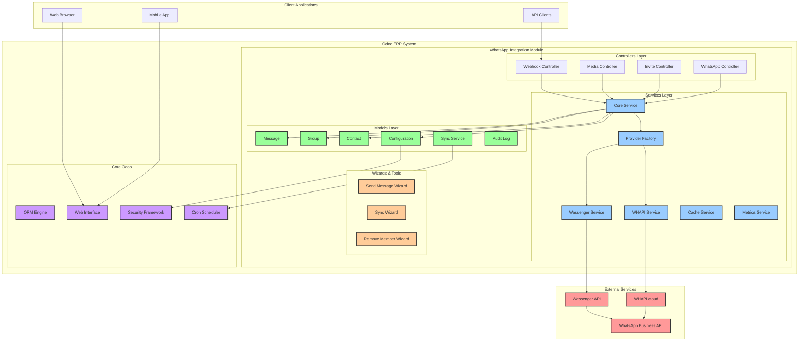

### 🔄 **Data Flow Diagram**

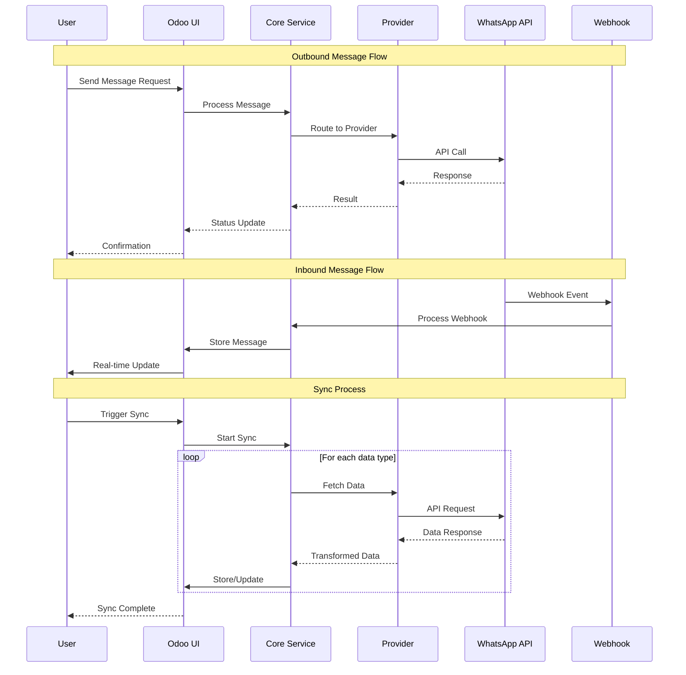

---

## ✨ Key Features

### 📱 **Communication Management**
- **Multi-Media Messaging**: Send/receive text, images, videos, documents, audio
- **Group Management**: Create, manage, and moderate WhatsApp groups
- **Contact Synchronization**: Automatic contact discovery and management
- **Message Status Tracking**: Real-time delivery, read receipt tracking
- **Media Library**: Centralized media file management and optimization

### 🔗 **API Integration**
- **Multi-Provider Support**: WHAPI.cloud, Wassenger, extensible for others
- **Webhook Processing**: Real-time event handling and processing
- **Rate Limiting**: Intelligent throttling and retry mechanisms
- **Error Handling**: Comprehensive error recovery and logging
- **API Health Monitoring**: Continuous service availability monitoring

### 🛡️ **Enterprise Security**
- **Role-Based Access**: Admin and User permission levels
- **Data Isolation**: Configuration-based data segregation
- **Audit Logging**: Complete activity tracking and compliance
- **Webhook Validation**: Cryptographic verification of incoming webhooks
- **Token Management**: Secure API credential storage and rotation

### 🔄 **Automation & Sync**
- **Automated Sync**: Scheduled synchronization with configurable intervals
- **Bulk Operations**: Mass messaging and member management
- **Wizard Interfaces**: User-friendly guided workflows
- **Background Processing**: Non-blocking operations for better UX
- **Conflict Resolution**: Intelligent handling of data conflicts

### 📊 **Analytics & Monitoring**
- **Performance Metrics**: Response times, success rates, error tracking
- **Usage Analytics**: Message volumes, user activity patterns
- **Health Dashboards**: Real-time system status monitoring
- **Audit Reports**: Comprehensive activity and compliance reporting

---

## 🔧 Installation

### 📋 **Prerequisites**

| Component | Version | Purpose |
|-----------|---------|---------|
| **Odoo** | 14.0+ | Core ERP platform |
| **Python** | 3.7+ | Runtime environment |
| **PostgreSQL** | 10+ | Database backend |
| **requests** | 2.31.0+ | HTTP client library |

### 🚀 **Installation Steps**

1. **Clone the Module**
   ```bash
   cd /path/to/odoo/addons
   git clone <repository-url> whatsapp_integration
   ```

2. **Install Dependencies**
   ```bash
   pip install -r whatsapp_integration/requirements.txt
   ```

3. **Update Odoo Apps List**
   ```bash
   # Restart Odoo server with update flag
   ./odoo-bin -u all -d <database_name>
   ```

4. **Install Module**
   - Navigate to **Apps** → **Update Apps List**
   - Search for "WhatsApp Integration"
   - Click **Install**

### ⚙️ **Post-Installation Setup**

1. **Security Groups Assignment**
   ```bash
   # Assign users to WhatsApp groups
   Settings → Users & Companies → Users
   # Add users to "WhatsApp Administrator" or "WhatsApp User" groups
   ```

2. **Configure Cron Jobs**
   ```bash
   # Enable automatic synchronization
   Settings → Technical → Automation → Scheduled Actions
   # Activate "WhatsApp Data Sync" actions
   ```

---

## ⚙️ Configuration

### 🔑 **API Provider Configuration**

#### **WHAPI.cloud Setup**
```python
# Configuration Example
{
    'name': 'Production WhatsApp',
    'provider': 'whapi',
    'token': 'your-whapi-token',
    'channel_id': 'webhook-channel-id',
    'supervisor_phone': '+1234567890',
    'active': True
}
```

#### **Webhook Configuration**
```bash
# Webhook URL Format
https://your-odoo-domain.com/whatsapp/webhook/<provider>

# Required Headers
Content-Type: application/json
Authorization: Bearer <webhook-token>
```

### 👥 **User Access Management**

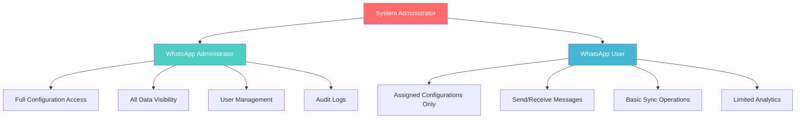

### 🔧 **Configuration Matrix**

| Feature | Admin | User | Notes |
|---------|-------|------|-------|
| **Create Configurations** | ✅ | ❌ | Admin-only |
| **Modify API Tokens** | ✅ | ❌ | Security sensitive |
| **Send Messages** | ✅ | ✅ | Based on assigned config |
| **Sync Data** | ✅ | ✅ | Limited to accessible data |
| **View Audit Logs** | ✅ | ❌ | Compliance requirement |
| **Manage Users** | ✅ | ❌ | Security control |

---

## 📊 System Diagrams

### 🏛️ **Database Schema Diagram**

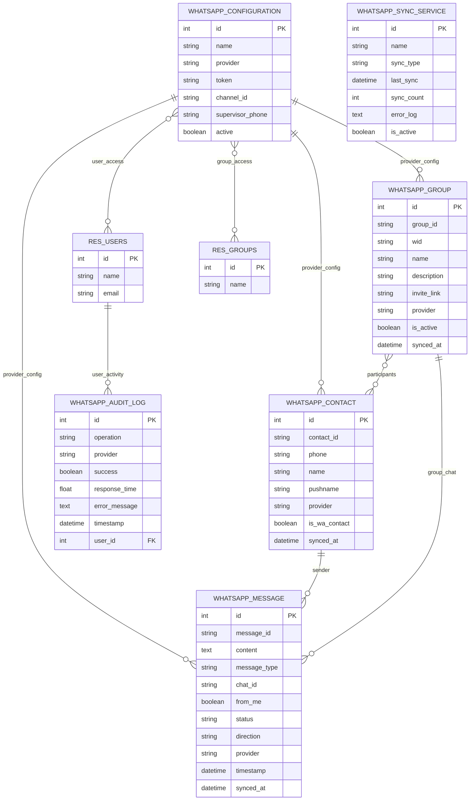

### 🔄 **Process Flow Diagram**

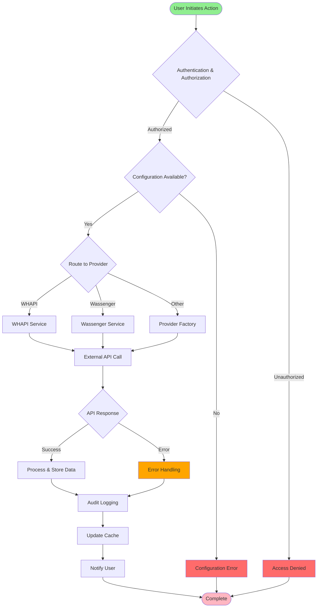

### 🌐 **Network Architecture Diagram**

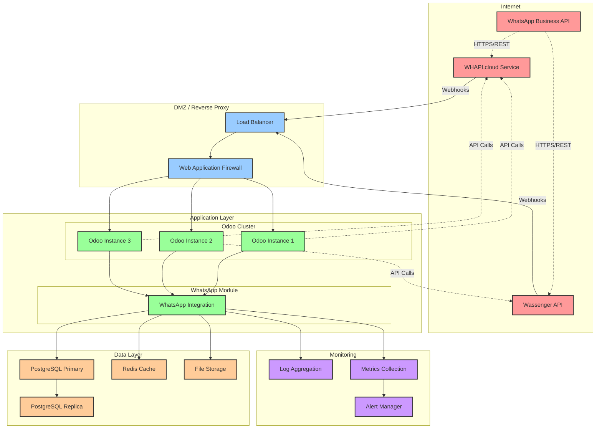

### 📈 **Performance Monitoring Dashboard**

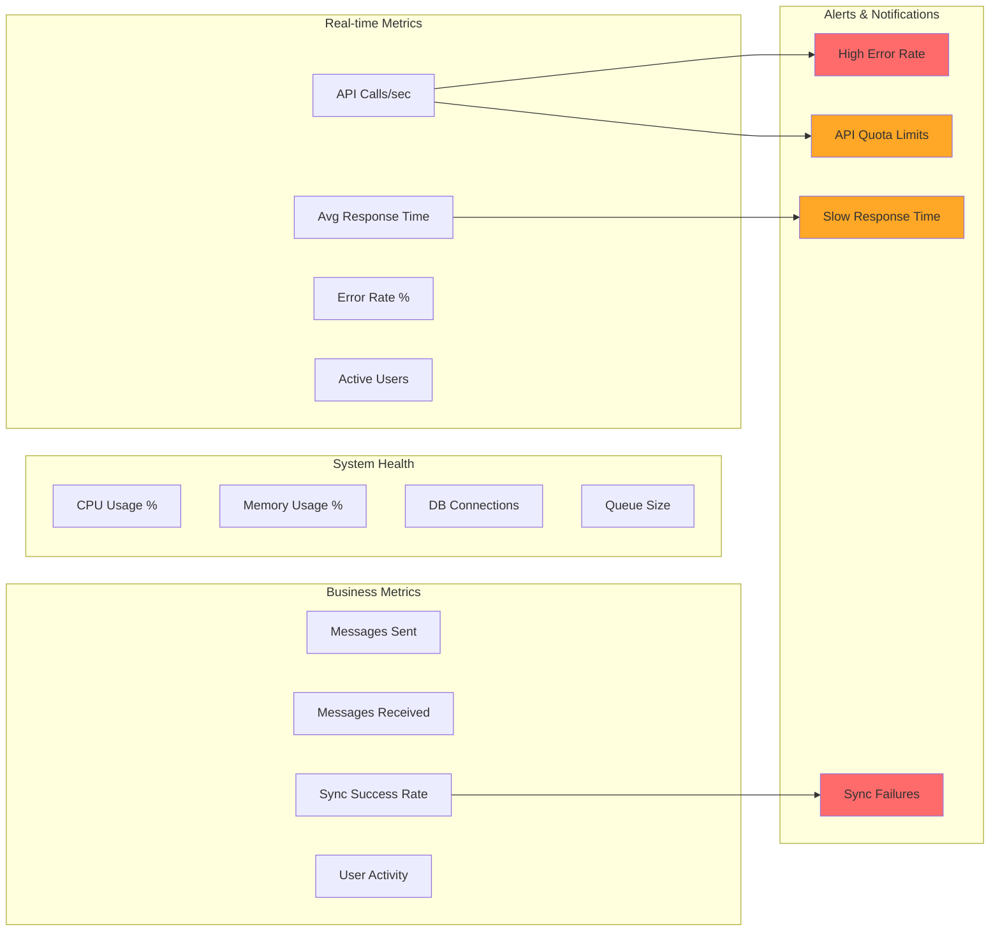

---

## 🔌 API Integration

### 🌟 **Supported Providers**

| Provider | Status | Features | Use Cases |
|----------|--------|----------|-----------|
| **WHAPI.cloud** | ✅ Primary | Full API, Webhooks, Media | Production environments |
| **Wassenger** | ✅ Legacy | Basic messaging, Groups | Legacy systems |
| **Custom** | 🔧 Extensible | Configurable | Enterprise needs |

### 📡 **Webhook Events**

```json
{
  "event_type": "message.received",
  "timestamp": "2024-01-15T10:30:00Z",
  "channel_id": "your-channel-id",
  "data": {
    "message": {
      "id": "msg_123456789",
      "from": "1234567890@s.whatsapp.net",
      "to": "group_id@g.us",
      "type": "text",
      "body": "Hello, this is a test message",
      "timestamp": 1642245000
    },
    "contact": {
      "name": "John Doe",
      "pushname": "John"
    }
  }
}
```

### 🔐 **Authentication Flow**

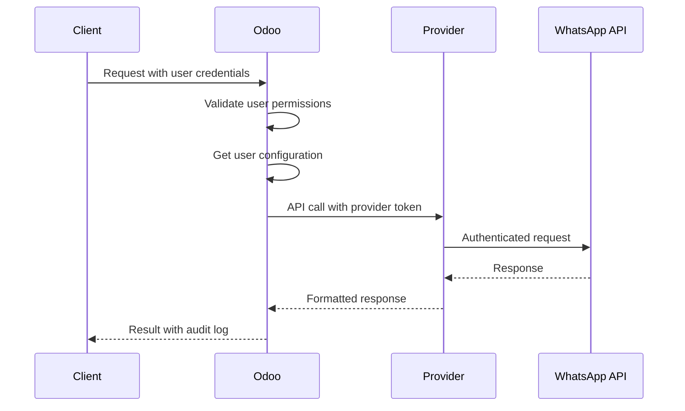

---

## 👥 User Guide

### 🚀 **Quick Start Guide**

#### **For Administrators**

1. **Initial Setup**
   ```
   Settings → WhatsApp → Configurations
   ├── Create new configuration
   ├── Set provider (WHAPI/Wassenger)
   ├── Enter API credentials
   └── Assign users/groups
   ```

2. **User Management**
   ```
   Settings → Users & Companies → Users
   ├── Select user
   ├── Add to WhatsApp groups
   └── Assign configurations
   ```

3. **Monitor System**
   ```
   WhatsApp → Audit Logs
   ├── View system activity
   ├── Monitor API usage
   └── Check error logs
   ```

#### **For End Users**

1. **Send Messages**
   ```
   WhatsApp → Send Message
   ├── Select recipient/group
   ├── Choose message type
   ├── Add content/media
   └── Send
   ```

2. **Sync Data**
   ```
   WhatsApp → Sync Wizard
   ├── Choose sync type
   ├── Select data categories
   └── Execute sync
   ```

3. **Manage Contacts**
   ```
   WhatsApp → Contacts
   ├── View contact list
   ├── Edit contact details
   └── Manage group memberships
   ```

### 📋 **Feature Tutorials**

#### **Creating and Managing Groups**

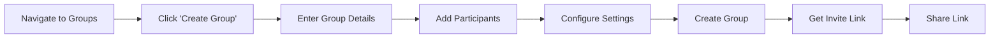

#### **Setting Up Automated Sync**

```mermaid
gantt
    title Sync Configuration Timeline
    dateFormat  HH:mm
    axisFormat %H:%M

    section Initial Setup
    Configure API       :done, setup, 09:00, 09:30
    Test Connection     :done, test, 09:30, 10:00
    
    section Sync Schedule
    Hourly Sync         :active, hourly, 10:00, 18:00
    Daily Full Sync     :daily, 00:00, 00:30
    
    section Monitoring
    Health Checks       :monitor, 10:00, 18:00
    Error Alerts        :alert, 10:00, 18:00
```

---

## 🔒 Security & Permissions

### 🛡️ **Security Architecture**

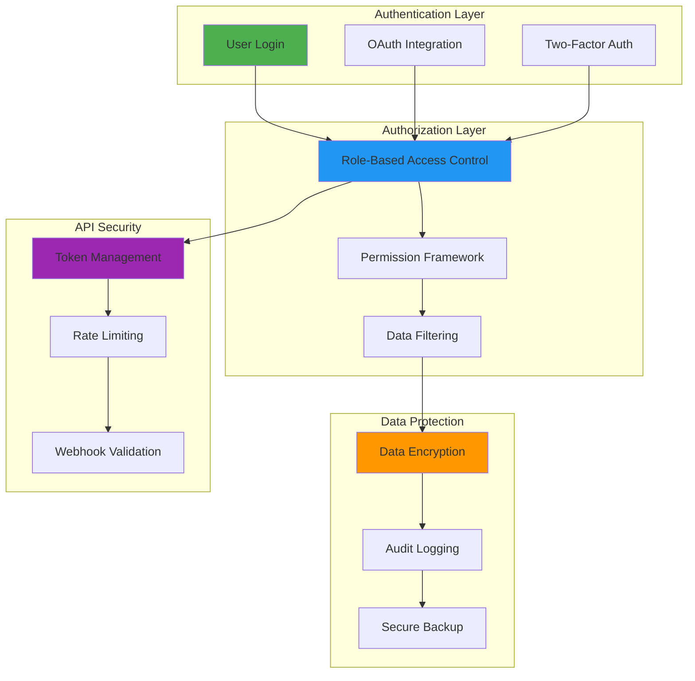

### 🔑 **Permission Matrix**

| Operation | WhatsApp Admin | WhatsApp User | Notes |
|-----------|----------------|---------------|-------|
| **Configuration Management** |
| Create/Edit Configurations | ✅ | ❌ | Admin only |
| View Configurations | ✅ | 👥 Assigned only | |
| Manage API Tokens | ✅ | ❌ | Security sensitive |
| **Data Operations** |
| Send Messages | ✅ | ✅ | Based on config access |
| Receive Messages | ✅ | ✅ | Auto-sync available |
| Sync All Data | ✅ | ✅ | Limited scope for users |
| **Management Operations** |
| Create Groups | ✅ | ✅ | Provider permissions apply |
| Manage Group Members | ✅ | ✅ | Group admin rights needed |
| Remove Members | ✅ | ❌ | Admin only |
| **Monitoring & Audit** |
| View Audit Logs | ✅ | ❌ | Compliance requirement |
| System Monitoring | ✅ | ❌ | Operational data |
| Error Diagnostics | ✅ | ❌ | Technical information |

### 🔐 **Data Encryption Standards**

- **API Tokens**: AES-256 encryption at rest
- **Message Content**: TLS 1.3 in transit
- **Webhook Validation**: HMAC-SHA256 signatures
- **Database**: Column-level encryption for sensitive data
- **File Storage**: Encrypted file system with key rotation

---

## 📈 Monitoring & Analytics

### 📊 **Key Performance Indicators (KPIs)**

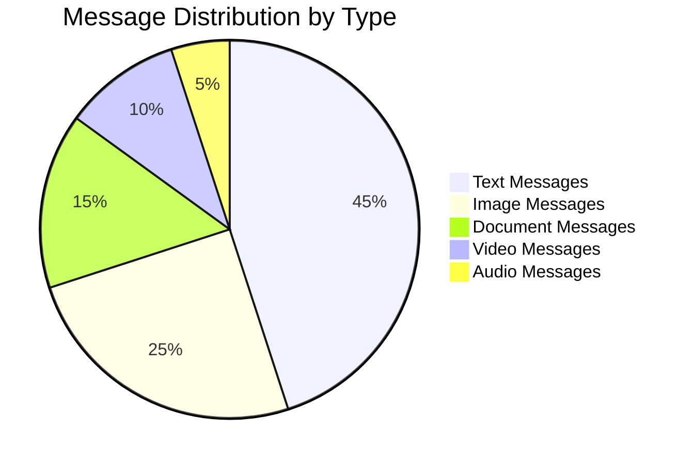

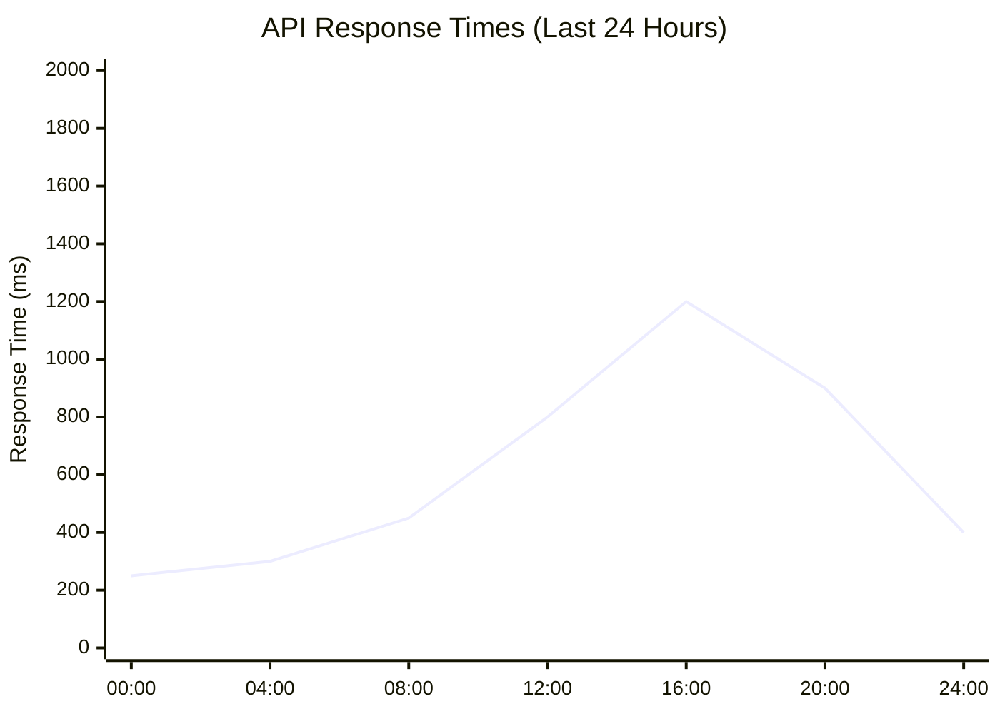

### 📈 **Analytics Dashboard Components**

| Metric Category | Measurements | Update Frequency |
|-----------------|--------------|------------------|
| **API Performance** | Response time, Success rate, Error rate | Real-time |
| **Message Analytics** | Volume, Types, Delivery status | Hourly |
| **User Activity** | Active users, Sessions, Operations | Daily |
| **System Health** | CPU, Memory, DB performance | Every 5 minutes |
| **Business Metrics** | Conversion rates, Engagement | Daily |

### 🔍 **Monitoring Tools Integration**

- **Prometheus**: Metrics collection and alerting
- **Grafana**: Dashboard visualization
- **ELK Stack**: Log aggregation and analysis
- **APM Tools**: Application performance monitoring
- **Custom Dashboards**: Odoo-native reporting

---

## 🛠️ Development

### 🏗️ **Module Structure**

```
whatsapp_integration/
├── 📁 controllers/          # HTTP Controllers
│   ├── webhook_controller.py    # Webhook handling
│   ├── media_controller.py      # Media management
│   ├── invite_controller.py     # Group invitations
│   └── whatsapp_controller.py   # Main API endpoints
├── 📁 models/               # Data Models
│   ├── whatsapp_configuration.py
│   ├── whatsapp_contact.py
│   ├── whatsapp_group.py
│   ├── whatsapp_message.py
│   └── whatsapp_sync_service.py
├── 📁 services/             # Business Logic
│   ├── whatsapp_core_service.py # Main orchestrator
│   ├── whapi_service.py         # WHAPI integration
│   ├── wassenger_api.py         # Wassenger integration
│   ├── whatsapp_provider_factory.py
│   └── 📁 adapters/            # Provider adapters
├── 📁 wizard/              # User Interfaces
│   ├── whatsapp_send_message_wizard.py
│   ├── whatsapp_sync_wizard.py
│   └── whatsapp_remove_member_wizard.py
├── 📁 views/               # UI Definitions
├── 📁 data/                # Demo & Initial Data
├── 📁 security/            # Access Control
├── 📁 tests/               # Unit & Integration Tests
├── 📄 __manifest__.py      # Module Declaration
├── 📄 requirements.txt     # Python Dependencies
└── 📄 README.md           # Documentation
```

### 🧪 **Testing Strategy**

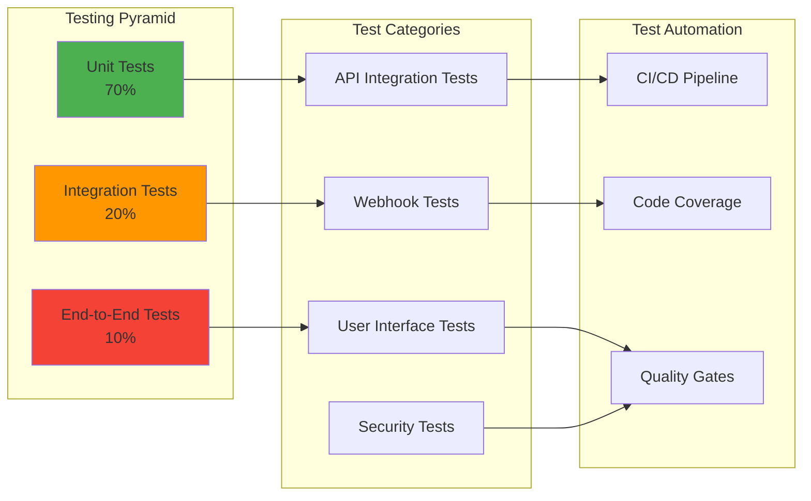

### 🔧 **Development Setup**

1. **Environment Preparation**
   ```bash
   # Clone repository
   git clone <repo-url> whatsapp_integration
   cd whatsapp_integration

   # Create virtual environment
   python -m venv venv
   source venv/bin/activate  # Linux/Mac
   # or
   venv\Scripts\activate     # Windows

   # Install dependencies
   pip install -r requirements.txt
   pip install -r requirements-dev.txt
   ```

2. **Development Tools**
   ```bash
   # Code formatting
   black whatsapp_integration/
   
   # Linting
   flake8 whatsapp_integration/
   
   # Type checking
   mypy whatsapp_integration/
   
   # Testing
   python -m pytest tests/
   ```

3. **Pre-commit Hooks**
   ```yaml
   # .pre-commit-config.yaml
   repos:
   - repo: https://github.com/psf/black
     rev: 22.3.0
     hooks:
     - id: black
   - repo: https://github.com/pycqa/flake8
     rev: 4.0.1
     hooks:
     - id: flake8
   ```

### 🏭 **Design Patterns Used**

| Pattern | Implementation | Purpose |
|---------|----------------|---------|
| **Factory Pattern** | `WhatsAppProviderFactory` | Provider abstraction |
| **Strategy Pattern** | Provider-specific services | Algorithm selection |
| **Observer Pattern** | Webhook processing | Event handling |
| **Repository Pattern** | Model data access | Data layer abstraction |
| **Command Pattern** | Wizard operations | Operation encapsulation |
| **Singleton Pattern** | Configuration management | Single instance control |

---

## 📚 API Reference

### 🔌 **Core Service API**

#### **Send Text Message**
```python
@api.model
def send_text_message(self, to: str, message: str, user_id: int = None) -> Dict:
    """
    Send text message using configured provider
    
    Args:
        to: Recipient phone number or group ID
        message: Text message content
        user_id: User ID for configuration lookup
        
    Returns:
        Dict with success status and details
    """
```

#### **Send Media Message**
```python
@api.model
def send_media_message(self, to: str, media_data: bytes, filename: str, 
                      media_type: str = 'image', caption: str = '', 
                      user_id: int = None) -> Dict:
    """
    Send media message using configured provider
    
    Args:
        to: Recipient phone number or group ID
        media_data: Binary media data
        filename: Original filename
        media_type: Type of media (image, video, audio, document)
        caption: Media caption
        user_id: User ID for configuration lookup
        
    Returns:
        Dict with success status and details
    """
```

#### **Sync Data**
```python
@api.model
def sync_contacts(self, user_id: int = None, **kwargs) -> Dict:
    """
    Sync contacts from provider
    
    Args:
        user_id: User ID for configuration lookup
        **kwargs: Additional parameters (limit, offset, etc.)
        
    Returns:
        Dict with sync results
    """
```

### 🌐 **REST API Endpoints**

| Endpoint | Method | Description | Auth Required |
|----------|--------|-------------|---------------|
| `/whatsapp/webhook/<provider>` | POST | Webhook receiver | Token |
| `/whatsapp/send/text` | POST | Send text message | Session |
| `/whatsapp/send/media` | POST | Send media message | Session |
| `/whatsapp/groups/create` | POST | Create group | Session |
| `/whatsapp/sync/trigger` | POST | Trigger sync | Session |
| `/whatsapp/health` | GET | Health check | None |

### 📊 **Response Formats**

#### **Success Response**
```json
{
  "success": true,
  "data": {
    "message_id": "msg_123456789",
    "status": "sent",
    "timestamp": "2024-01-15T10:30:00Z"
  },
  "meta": {
    "provider": "whapi",
    "response_time": 250
  }
}
```

#### **Error Response**
```json
{
  "success": false,
  "error": {
    "code": "API_ERROR",
    "message": "Rate limit exceeded",
    "details": {
      "retry_after": 60,
      "quota_remaining": 0
    }
  },
  "meta": {
    "provider": "whapi",
    "request_id": "req_123456789"
  }
}
```

---

## 🤝 Contributing

### 🎯 **Contribution Guidelines**

We welcome contributions from the community! Please follow these guidelines:

#### **Getting Started**
1. Fork the repository
2. Create a feature branch: `git checkout -b feature/amazing-feature`
3. Make your changes
4. Add tests for new functionality
5. Ensure all tests pass
6. Submit a pull request

#### **Code Standards**
- Follow PEP 8 style guidelines
- Add docstrings to all public methods
- Include type hints where appropriate
- Write comprehensive tests
- Update documentation

#### **Pull Request Process**
1. Update README.md with details of changes
2. Update version numbers following semantic versioning
3. Ensure CI/CD pipeline passes
4. Request review from maintainers

### 🐛 **Bug Reports**

Please use the issue tracker with:
- Clear description of the problem
- Steps to reproduce
- Expected vs actual behavior
- Environment details
- Log excerpts (if applicable)

### 💡 **Feature Requests**

For new features, please provide:
- Use case description
- Proposed solution
- Alternative solutions considered
- Impact assessment

---

## 📄 License

This project is licensed under the **GNU Lesser General Public License v3.0 (LGPL-3.0)**.

### 📋 **License Summary**

- ✅ **Commercial Use**: Permitted
- ✅ **Modification**: Permitted
- ✅ **Distribution**: Permitted
- ✅ **Private Use**: Permitted
- ❌ **Liability**: Not provided
- ❌ **Warranty**: Not provided
- ⚠️ **License and Copyright Notice**: Required
- ⚠️ **Disclose Source**: Required for modifications

### 🔗 **Third-Party Licenses**

| Component | License | Usage |
|-----------|---------|-------|
| **requests** | Apache 2.0 | HTTP client library |
| **Odoo** | LGPL-3.0 | Core platform |
| **Python** | PSF | Runtime environment |

---

## 📞 Contact & Support

### 👨‍💻 **Author**
**Osama Mohamed**
- 🌐 LinkedIn: [linkedin.com/in/osamam0](https://www.linkedin.com/in/osamam0)
- 📧 Email: [Contact via LinkedIn]
- 🔗 Portfolio: [Professional Profile]

### 🆘 **Support Channels**

| Support Type | Channel | Response Time |
|--------------|---------|---------------|
| **Bug Reports** | GitHub Issues | 24-48 hours |
| **Feature Requests** | GitHub Discussions | 3-5 days |
| **Security Issues** | Private Email | 12-24 hours |
| **General Questions** | LinkedIn | 1-3 days |

### 📈 **Project Status**

- **Current Version**: 14.0.4.2.0
- **Stability**: Production Ready
- **Maintenance**: Actively Maintained
- **Last Updated**: September 2025

---

## 🙏 Acknowledgments

Special thanks to:
- **Odoo Community**: For the amazing ERP platform
- **WHAPI.cloud**: For reliable WhatsApp Business API
- **Wassenger**: For legacy API support
- **Contributors**: Everyone who helped improve this module
- **Early Adopters**: Users who provided valuable feedback

---

<div align="center">

### 🌟 **Star this repository if it helped you!** 🌟

**Made with ❤️ for the Odoo community By Osama Mohamed**

---

*This documentation is automatically updated with each release.*

</div>
